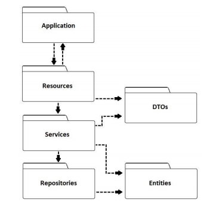

# Aircnc

## Grupo

- **Lucas Mourão Ferreira**
- **Ramon Ribeiro Feliciano**
- **Vitor Lucio dos Santos Ferreira**
- **Bruna Campos de Melo**

## Tecnologias Utilizadas:

- **Backend:** Rest Api escrita em Python no framework Flask e utilizando MySQL. O
- **Frontend:** Javascript/CSS/HTML com React.

## Arquitetura

**Application:** Frontend da aplicação web, que realiza o consumo dos endpoints
da API REST no Backend e disponibiliza os dados de forma interativa e
intuitiva para o usuário.

**Resources:** Camada do Backend responsável por disponibilizar os endpoints da API, realizando as operações HTTP PUT, GET, POST e DELETE.

**Services:** Camada do Backend responsável pelas regras de negócio da aplicação.

**Repositories:** Camada do Backend responsável pela persistência de dados na base de dados.

**Entities:** Objetos mapeados na base de dados.

**Data Transfer Objects (DTOs):** Objetos utilizados na comunicação entre Backend e Frontend.

## Estórias e Tarefas

**1. Modelar Entities e DTOs.**

Tarefas:

- Criação do projeto inicial do Backend, com as dependências iniciais – **Vitor**.
- Modelar Entity User – **Ramon**.
- Modelar DTO UserAuthenticationDTO – **Vitor**.
- Modelar DTO UserCreationDTO – **Ramon**.
- Modelar DTO UserEditDTO – **Ramon**.
- Modelar Entity Place – **Ramon**.
- Modelar DTO SimplePlaceDTO – **Ramon**.
- Modelar DTO CompletePlaceDTO – **Bruna**.
- Modelar DTO PlaceCreationDTO – **Bruna**.
- Modelar DTO PlaceEditDTO – **Bruna**.
- Modelar Entity Rent – **Bruna**.
- Modelar DTO RentOrderDTO – **Bruna**.

**2. Autenticação de usuário com JWT.**

Tarefas:

- Criação do projeto inicial do Frontend com as dependências iniciais – **Lucas**.
- Implementação dos services e resources associados a autenticação por JWT – método POST no path “/auth” – **Vitor**.
- Implementação de método para identificar usuário a partir do token JWT – **Vitor**.
- Lidar com a autenticação e manuseio do JWT no Frontend – **Lucas**.

**3. Operações de criação, deleção e edição de usuário.**

Tarefas:

- Implementação dos services e resources associados a criação – método POST no path “/users” – **Ramon**.
- Implementação dos services e resources associados a deleção – método DELETE no path “/users” – **Ramon**.
- Implementação dos services e resources associados edição – método PUT no path “/users” – **Ramon**.
- Implementação dos services e resources associados a leitura – método GET no path “/users” – **Ramon**.
- Realizar as chamadas dos métodos pelo Frontend e mostrar para o usuário os dados de forma intuitiva e interativa – **Lucas**.

**4. Operações de criação, deleção e edição de lugares como anfitrião e operação
de leitura.**

Tarefas:

- Implementação dos services e resources associados a criação – método POST no path “/places/{place_id}” – **Bruna**.
- Implementação dos services e resources associados a deleção – método DELETE no path “/places/{place_id}” – **Bruna**.
- Implementação dos services e resources associados a edição – método PUT no path “/places/{place_id}” – **Bruna**.
- Implementação dos services e resources associados a leitura – método GET no path “/places/{place_id}” – **Bruna**.
  •Realizar as chamadas dos métodos pelo Frontend e mostrar para o usuário os dados de forma intuitiva e interativa – **Lucas**.

**5. Pesquisar lugares utilizando diferente filtros (tipo de lugar, localização, data de check-in e checkout e preço).**

Tarefas:

- Implementação dos services e resources associados a leitura de todos os lugares com filtros – método GET no path “/places” – **Bruna**.
- Realizar as chamadas dos métodos pelo Frontend e mostrar para o usuário os dados de forma intuitiva e interativa – **Lucas**.

**6. Alugar para determinada data se disponível.**

Tarefas:

- Implementação dos services e resources associados ao aluguel de um lugar – método Post no path “/places/rent/{place_id}” – **Vitor**.
- Realizar as chamadas dos métodos pelo Frontend e mostrar para o usuário os dados de forma intuitiva e interativa – **Lucas**.
